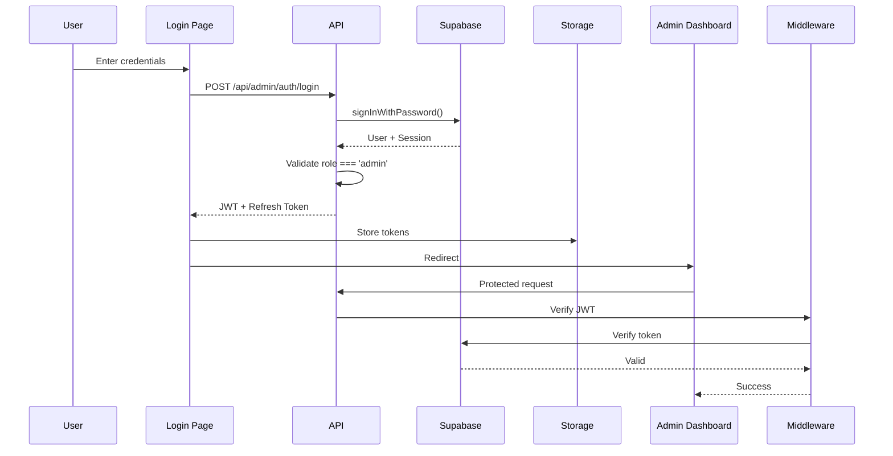

# Product Requirements Document (PRD)
## Admin Module: Login & Authentication System

**Project**: Mock Exam Booking System - Admin Module  
**Date**: October 22, 2025  
**Requested By**: System Requirements  
**Priority**: [X] Critical  
**Status**: 📋 Planning

---

## 📋 **Feature Summary**

### **Brief Description**
A secure authentication system for the admin portal that leverages Supabase Auth services to provide email/password login, session management, and role-based access control. This system serves as the gateway to all administrative functions, ensuring only authorized personnel can access sensitive operations like mock exam creation, user management, and system configuration.

### **Category**
- [X] ✨ **New Feature** - Add new functionality
- [X] 🗃️ **Infrastructure** - Backend, deployment, or architecture changes
- [X] 🔐 **Security** - Security-related changes (authentication & authorization)

### **Business Value**
This authentication system provides:
- **Security**: Industry-standard authentication protecting sensitive admin operations
- **Accountability**: User activity tracking with proper audit trails
- **Scalability**: Foundation for role-based permissions as the team grows
- **User Experience**: Seamless login with session persistence and "remember me" functionality
- **Compliance**: Proper access controls required for handling student data and financial information

---

## 🎯 **Current State vs Desired State**

### **What's happening now?**
Currently, there is no authentication system for the admin portal. The admin routes at `/admin/*` exist but are completely unprotected, meaning:
- Anyone with the URL can access administrative functions
- No way to identify who performed administrative actions
- No session management or logout functionality
- Cannot enforce role-based permissions
- Security vulnerability exposing sensitive operations

### **What should happen instead?**
System administrators should have access to a secure login page at `/admin/login` where they can:
- Authenticate using email and password via Supabase Auth
- See clear error messages for failed login attempts
- Maintain authenticated sessions with automatic token refresh
- Optionally stay logged in across browser sessions ("Remember Me")
- Securely logout when finished
- Be automatically redirected to login if their session expires
- Access admin routes only after successful authentication
- Have their role validated against Supabase user metadata

### **Why is this change needed?**
**Security Imperative:** Without authentication, the admin portal is a critical security vulnerability that could lead to:
- Unauthorized access to student data (privacy breach)
- Manipulation of mock exam schedules affecting operations
- Creation of fraudulent bookings
- Exposure of business metrics and sensitive information

**Operational Necessity:** Authentication enables:
- Audit trails for compliance and troubleshooting
- Multi-user admin access with proper accountability
- Foundation for future role-based permissions (super admin, staff, etc.)

**Professional Standards:** Authentication is a baseline requirement for any admin system handling sensitive data.

---

## 📝 **Technical Details**

### **Affected Components**
- [X] 🔙 **Backend API** (`/api/admin/auth/`)
- [X] 🖥️ **Frontend React App** (`/frontend/src/pages/admin/`)
- [X] 🔐 **Supabase Integration** (Auth services, user management)
- [X] 🛡️ **Middleware** (Protected route components)
- [X] ☁️ **Vercel Deployment** (Environment variables, secrets)
- [X] 📖 **Documentation** (Setup guide, security practices)

### **New Files/Endpoints Structure**

#### Backend Structure
```
api/
├── admin/
│   ├── auth/
│   │   ├── login.js              # POST /api/admin/auth/login
│   │   ├── logout.js             # POST /api/admin/auth/logout
│   │   ├── refresh.js            # POST /api/admin/auth/refresh
│   │   ├── validate.js           # GET /api/admin/auth/validate
│   │   └── me.js                 # GET /api/admin/auth/me
│   └── middleware/
│       ├── requireAuth.js        # Authentication middleware
│       └── requireAdmin.js       # Role validation middleware
└── _shared/
    └── supabase.js               # Supabase client configuration
```

#### Frontend Structure
```
frontend/src/
├── pages/
│   └── admin/
│       ├── Login.jsx             # Main login page
│       ├── ForgotPassword.jsx    # Password reset flow
│       └── AdminLayout.jsx       # Wrapper with auth check
├── components/
│   └── admin/
│       ├── ProtectedAdminRoute.jsx  # Route guard component
│       ├── LoginForm.jsx            # Login form UI
│       └── AuthProvider.jsx         # Auth context provider
├── hooks/
│   ├── useAuth.js                   # Authentication hook
│   └── useRequireAuth.js            # Protected route hook
├── services/
│   └── authService.js               # Auth API client
└── utils/
    ├── supabaseClient.js            # Supabase client config
    └── tokenManager.js              # Token storage/refresh
```

### **API Endpoints**

#### 1. Login
```
POST /api/admin/auth/login
Authentication: Not required
```

**Request Body:**
```json
{
  "email": "admin@prepdoctors.ca",
  "password": "secure_password",
  "rememberMe": true
}
```

**Response (Success):**
```json
{
  "success": true,
  "user": {
    "id": "uuid-here",
    "email": "admin@prepdoctors.ca",
    "role": "admin",
    "user_metadata": {
      "full_name": "John Admin",
      "department": "Operations"
    }
  },
  "session": {
    "access_token": "jwt-token-here",
    "refresh_token": "refresh-token-here",
    "expires_at": 1729648560,
    "expires_in": 3600
  }
}
```

**Response (Error):**
```json
{
  "success": false,
  "error": {
    "code": "INVALID_CREDENTIALS",
    "message": "Invalid email or password"
  }
}
```

#### 2. Logout
```
POST /api/admin/auth/logout
Authentication: Required
```

**Request Headers:**
```
Authorization: Bearer <access_token>
```

**Response:**
```json
{
  "success": true,
  "message": "Successfully logged out"
}
```

#### 3. Validate Session
```
GET /api/admin/auth/validate
Authentication: Required
```

**Response:**
```json
{
  "valid": true,
  "user": {
    "id": "uuid-here",
    "email": "admin@prepdoctors.ca",
    "role": "admin"
  }
}
```

#### 4. Refresh Token
```
POST /api/admin/auth/refresh
Authentication: Required (Refresh Token)
```

**Request Body:**
```json
{
  "refresh_token": "refresh-token-here"
}
```

**Response:**
```json
{
  "success": true,
  "session": {
    "access_token": "new-jwt-token",
    "refresh_token": "new-refresh-token",
    "expires_at": 1729652160,
    "expires_in": 3600
  }
}
```

#### 5. Get Current User
```
GET /api/admin/auth/me
Authentication: Required
```

**Response:**
```json
{
  "id": "uuid-here",
  "email": "admin@prepdoctors.ca",
  "role": "admin",
  "user_metadata": {
    "full_name": "John Admin",
    "department": "Operations",
    "avatar_url": "https://..."
  },
  "created_at": "2025-01-15T10:30:00Z",
  "last_sign_in": "2025-10-22T09:15:00Z"
}
```

### **Supabase Configuration**

#### User Metadata Schema
```typescript
// Stored in auth.users.user_metadata
{
  "role": "admin" | "super_admin" | "staff",
  "full_name": string,
  "department": string,
  "permissions": string[],
  "avatar_url": string | null
}
```

#### Role Hierarchy
```javascript
const ROLES = {
  SUPER_ADMIN: 'super_admin',  // Full system access
  ADMIN: 'admin',              // Standard admin operations
  STAFF: 'staff'               // Limited read-only access
};

const ROLE_PERMISSIONS = {
  super_admin: ['*'],
  admin: ['create_mock_exams', 'edit_mock_exams', 'view_bookings', 'manage_users'],
  staff: ['view_mock_exams', 'view_bookings']
};
```

#### Supabase Auth Policies
```sql
-- Enable Row Level Security
ALTER TABLE auth.users ENABLE ROW LEVEL SECURITY;

-- Only authenticated users can view their own data
CREATE POLICY "Users can view own data"
ON auth.users FOR SELECT
USING (auth.uid() = id);

-- Admin metadata validation
CREATE OR REPLACE FUNCTION is_admin()
RETURNS BOOLEAN AS $$
BEGIN
  RETURN (
    SELECT (auth.jwt() -> 'user_metadata' ->> 'role')::TEXT IN ('admin', 'super_admin')
  );
END;
$$ LANGUAGE plpgsql SECURITY DEFINER;
```

### **Data Requirements**

#### Environment Variables
```bash
# Supabase Configuration
SUPABASE_URL=https://your-project.supabase.co
SUPABASE_ANON_KEY=your-anon-key-here
SUPABASE_SERVICE_ROLE_KEY=your-service-key-here

# JWT Configuration
SUPABASE_JWT_SECRET=your-jwt-secret-here

# Session Configuration
SESSION_EXPIRY=3600              # 1 hour in seconds
REFRESH_TOKEN_EXPIRY=604800      # 7 days in seconds
```

#### Local Storage Keys
```javascript
// Token storage (browser localStorage/sessionStorage)
'supabase.auth.token'         // JWT access token
'supabase.auth.refresh_token' // Refresh token
'supabase.auth.expires_at'    // Token expiry timestamp
'admin.remember_me'           // Remember me preference
```

---

## 💥 **User Impact**

### **Who will this affect?**
- [X] PrepDoctors admin staff
- [X] System administrators
- [X] Future authorized users (when roles expand)

### **User Stories**

**As an admin user, I want to:**
- Log in securely with my email and password so that only authorized personnel can access admin functions
- Stay logged in across browser sessions if I choose "Remember Me" so that I don't have to log in repeatedly
- Be automatically logged out after inactivity so that my session doesn't remain open if I forget to log out
- See clear error messages if my login fails so that I know what went wrong
- Reset my password if I forget it so that I can regain access without IT intervention

**As a system administrator, I want to:**
- Know who performed which administrative actions so that we have proper audit trails
- Manage admin user accounts through Supabase so that we can add/remove access as needed
- Set different permission levels for different admin users so that staff have appropriate access
- Monitor failed login attempts so that we can detect potential security threats

---

## 🧪 **Testing Requirements**

### **Unit Tests**

#### Backend Tests
```javascript
describe('Admin Auth API', () => {
  describe('POST /api/admin/auth/login', () => {
    test('should return session for valid credentials', async () => {});
    test('should reject invalid email', async () => {});
    test('should reject invalid password', async () => {});
    test('should reject non-admin users', async () => {});
    test('should handle remember me option', async () => {});
    test('should rate limit failed attempts', async () => {});
  });

  describe('POST /api/admin/auth/logout', () => {
    test('should invalidate session', async () => {});
    test('should clear refresh tokens', async () => {});
    test('should require authentication', async () => {});
  });

  describe('GET /api/admin/auth/validate', () => {
    test('should validate active session', async () => {});
    test('should reject expired token', async () => {});
    test('should reject invalid token', async () => {});
  });

  describe('POST /api/admin/auth/refresh', () => {
    test('should issue new tokens with valid refresh token', async () => {});
    test('should reject invalid refresh token', async () => {});
    test('should reject expired refresh token', async () => {});
  });
});
```

#### Frontend Tests
```javascript
describe('LoginForm Component', () => {
  test('should render email and password fields', () => {});
  test('should validate email format', () => {});
  test('should show password visibility toggle', () => {});
  test('should display error messages', () => {});
  test('should handle form submission', () => {});
  test('should disable button during login', () => {});
});

describe('useAuth Hook', () => {
  test('should provide login function', () => {});
  test('should provide logout function', () => {});
  test('should track authentication state', () => {});
  test('should handle token refresh', () => {});
  test('should persist state across page reloads', () => {});
});

describe('ProtectedAdminRoute', () => {
  test('should redirect unauthenticated users to login', () => {});
  test('should render content for authenticated users', () => {});
  test('should validate admin role', () => {});
  test('should handle expired sessions', () => {});
});
```

### **Integration Tests**
- Test complete login flow from form submission to authenticated session
- Verify protected routes redirect to login correctly
- Test token refresh before expiration
- Verify logout clears all session data
- Test "Remember Me" persists across browser restarts
- Confirm rate limiting prevents brute force attacks

### **Manual Testing Checklist**
- [ ] Verify admin can log in with valid credentials
- [ ] Confirm non-admin users are rejected
- [ ] Test password visibility toggle works
- [ ] Verify "Remember Me" persists sessions
- [ ] Test automatic logout after token expiry
- [ ] Confirm protected routes redirect to login
- [ ] Test manual logout clears session
- [ ] Verify error messages are user-friendly
- [ ] Test forgot password flow (future)
- [ ] Confirm responsive design on mobile
- [ ] Test session persistence across tabs
- [ ] Verify automatic token refresh works

---

## 🛡️ **Security & Access Control**

### **Authentication Flow**


### **Security Measures**

#### Password Requirements
- Minimum 8 characters
- Must include: uppercase, lowercase, number, special character
- Cannot be common passwords (dictionary check)
- Cannot match email or username
- Enforced by Supabase Auth policies

#### Rate Limiting
```javascript
// Login endpoint rate limits
const RATE_LIMITS = {
  login: {
    max: 5,           // 5 attempts
    window: 900000,   // per 15 minutes
    blockDuration: 3600000  // block for 1 hour after
  },
  refresh: {
    max: 10,
    window: 60000     // per minute
  }
};
```

#### Session Management
- Access tokens expire after 1 hour
- Refresh tokens expire after 7 days
- Automatic refresh 5 minutes before expiry
- Logout invalidates both tokens
- Remember Me uses httpOnly secure cookies

#### Security Headers
```javascript
// Applied to all admin API endpoints
{
  'Strict-Transport-Security': 'max-age=31536000',
  'X-Content-Type-Options': 'nosniff',
  'X-Frame-Options': 'DENY',
  'X-XSS-Protection': '1; mode=block',
  'Content-Security-Policy': "default-src 'self'"
}
```

#### Token Storage
- Access tokens: Memory only (React state)
- Refresh tokens: HttpOnly secure cookies (if Remember Me)
- Never expose tokens in URL or logs
- Clear all tokens on logout

---

## 📊 **Success Criteria**

### **How will we know this is complete?**
- [ ] Admin users can successfully log in with Supabase credentials
- [ ] Non-admin users are properly rejected with appropriate error message
- [ ] All `/admin/*` routes are protected and redirect to login when unauthenticated
- [ ] Sessions persist across page refreshes and browser tabs
- [ ] "Remember Me" functionality works across browser restarts
- [ ] Logout properly clears all session data
- [ ] Token refresh happens automatically before expiration
- [ ] Failed login attempts are rate limited after 5 tries
- [ ] Login page is responsive and works on mobile devices
- [ ] All error messages are user-friendly and actionable

### **Metrics to Track**
- Login success rate (target: >95%)
- Failed login attempts (monitor for security)
- Average login time (target: <2 seconds)
- Session duration (track for UX insights)
- Token refresh success rate (target: 100%)
- Password reset requests (future metric)
- Active admin users per day/week

---

## 📝 **Additional Context**

### **Technical Notes**

#### Supabase Client Initialization
```javascript
// Frontend: /frontend/src/utils/supabaseClient.js
import { createClient } from '@supabase/supabase-js';

export const supabase = createClient(
  process.env.VITE_SUPABASE_URL,
  process.env.VITE_SUPABASE_ANON_KEY,
  {
    auth: {
      persistSession: true,
      autoRefreshToken: true,
      detectSessionInUrl: false
    }
  }
);
```

#### Backend Middleware Example
```javascript
// Backend: /api/admin/middleware/requireAuth.js
import { createClient } from '@supabase/supabase-js';

export async function requireAuth(req) {
  const authHeader = req.headers.authorization;
  
  if (!authHeader?.startsWith('Bearer ')) {
    throw new Error('Missing or invalid authorization header');
  }

  const token = authHeader.substring(7);
  const supabase = createClient(
    process.env.SUPABASE_URL,
    process.env.SUPABASE_SERVICE_ROLE_KEY
  );

  const { data: { user }, error } = await supabase.auth.getUser(token);
  
  if (error || !user) {
    throw new Error('Invalid or expired token');
  }

  // Validate admin role
  const role = user.user_metadata?.role;
  if (!['admin', 'super_admin'].includes(role)) {
    throw new Error('Insufficient permissions');
  }

  return user;
}
```

### **Future Enhancements**
- Multi-factor authentication (MFA) via Supabase
- Single Sign-On (SSO) integration
- Social auth providers (Google, Microsoft)
- Password reset via email
- Account lockout after repeated failures
- Login activity logs and audit trail
- User profile management page
- Permission management UI

### **Design Specifications**
- Follow PrepDoctors brand guidelines (blue #003E6B, teal #4ECDC4)
- Login form should be centered on page
- Use card-style container with subtle shadow
- Include PrepDoctors logo at top
- Error messages in red with icon
- Loading states with spinner
- Password field with show/hide toggle
- "Remember Me" checkbox below form
- "Forgot Password?" link (future)

---

## ✅ **Implementation Checklist**

- [ ] **Phase 1: Supabase Setup**
  - [ ] Create Supabase project
  - [ ] Configure auth settings (email/password enabled)
  - [ ] Set up user roles in user_metadata
  - [ ] Create admin users in Supabase dashboard
  - [ ] Configure environment variables

- [ ] **Phase 2: Backend API**
  - [ ] Create Supabase client utility
  - [ ] Implement login endpoint
  - [ ] Implement logout endpoint
  - [ ] Implement token refresh endpoint
  - [ ] Implement session validation endpoint
  - [ ] Create authentication middleware
  - [ ] Create role validation middleware
  - [ ] Add rate limiting
  - [ ] Write backend unit tests

- [ ] **Phase 3: Frontend Implementation**
  - [ ] Create Login page component
  - [ ] Build LoginForm with validation
  - [ ] Implement useAuth hook
  - [ ] Create ProtectedAdminRoute component
  - [ ] Set up AuthProvider context
  - [ ] Implement token storage utilities
  - [ ] Add automatic token refresh
  - [ ] Create loading and error states
  - [ ] Write frontend unit tests

- [ ] **Phase 4: Integration & Testing**
  - [ ] Integration testing of complete flow
  - [ ] Security testing (penetration testing basics)
  - [ ] Performance testing
  - [ ] Cross-browser testing
  - [ ] Mobile responsiveness testing
  - [ ] Test all error scenarios

- [ ] **Phase 5: Deployment**
  - [ ] Configure Vercel environment variables
  - [ ] Deploy to staging environment
  - [ ] Conduct UAT with admin users
  - [ ] Deploy to production
  - [ ] Monitor for errors

- [ ] **Phase 6: Documentation**
  - [ ] Write setup guide for developers
  - [ ] Create admin user guide
  - [ ] Document security practices
  - [ ] Update API documentation
  - [ ] Create troubleshooting guide

---

## 📞 **Contact Information**

**Requester**: System Requirements  
**Technical Lead**: [Assign developer]  
**Security Review**: Required before production  
**Estimated Timeline**: 1-2 weeks

---

## 🔄 **Dependencies**

### **External Services**
- Supabase project with Auth enabled
- Vercel deployment with environment variables
- DNS configuration (if using custom domain)

### **Related Features**
- This login system is a prerequisite for:
  - Admin Mock Exam Creation module
  - User management interface
  - Analytics dashboard
  - All future admin features

---

**🎯 Ready for Implementation**

This PRD provides a complete specification for implementing secure admin authentication using Supabase. The system will serve as the foundation for all administrative features while maintaining security best practices and excellent user experience.