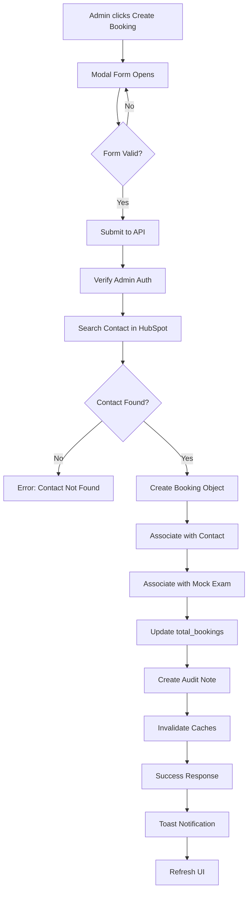

# PRD: Admin Booking Creation from Mock Exam Details

**Version:** 1.0.0
**Date:** 2025-11-11
**Status:** Ready for Implementation
**Estimated Timeline:** 8-12 hours

---

## 1. Executive Summary

### Overview
Enable administrators to create bookings directly from the mock exam details page, bypassing standard token and capacity constraints. This provides flexibility for special cases (e.g., late registrations, VIP bookings, manual adjustments) while maintaining comprehensive audit trails.

### Business Value
- **Administrative Flexibility**: Handle edge cases without workarounds
- **Improved User Experience**: Admins can quickly book trainees without switching contexts
- **Audit Compliance**: All admin-created bookings are tracked with detailed notes
- **Operational Efficiency**: Reduces manual workarounds and support tickets

### Key Differentiators from User Booking Flow
| Feature | User Booking Flow | Admin Booking Flow |
|---------|------------------|-------------------|
| Token Validation | ✅ Required | ❌ Bypassed |
| Capacity Checks | ✅ Enforced | ⚠️ Warning only |
| Redis Locks | ✅ Required | ❌ Not needed |
| Contact Search | Auto (from auth) | Manual (admin provides) |
| Email Notification | Standard confirmation | Admin action notification |
| Audit Trail | Standard note | Enhanced admin audit note |

---

## 2. Technical Specification

### 2.1 Architecture Overview

```
┌─────────────────────────────────────────────────────────────┐
│                    Admin Frontend                            │
│  MockExamDetailsPage → CreateBookingButton → Modal Form      │
└─────────────────────────────────────────────────────────────┘
                              │
                              ▼
┌─────────────────────────────────────────────────────────────┐
│                    Admin API Layer                           │
│  POST /api/admin/bookings/create-from-exam                   │
│  - Authentication: requireAdmin middleware                    │
│  - Validation: Joi schema (admin-specific)                   │
│  - NO token checks, NO capacity enforcement                  │
└─────────────────────────────────────────────────────────────┘
                              │
                              ▼
┌─────────────────────────────────────────────────────────────┐
│                    HubSpot Service Layer                     │
│  1. Search contact (student_id + email)                      │
│  2. Create booking object                                    │
│  3. Create associations (Contact, Mock Exam)                 │
│  4. Update total_bookings counter                            │
│  5. Create comprehensive audit note                          │
└─────────────────────────────────────────────────────────────┘
```

### 2.2 Data Flow



---

## 3. API Endpoints

### 3.1 New Endpoint: Create Admin Booking

**Endpoint:** `POST /api/admin/bookings/create-from-exam`

**Authentication:** Required (requireAdmin middleware)

**Request Body:**
```json
{
  "mock_exam_id": "123456789",
  "student_id": "ABC123",
  "email": "trainee@example.com",
  "mock_type": "Situational Judgment",
  "exam_date": "2025-12-25",
  "name": "John Doe",
  "attending_location": "mississauga",  // Required for SJ/Mini-mock
  "dominant_hand": true,                 // Required for Clinical Skills
  "bypass_capacity": false               // Optional flag to skip capacity warning
}
```

**Validation Schema (Joi):**
```javascript
const adminBookingCreationSchema = Joi.object({
  mock_exam_id: Joi.string().required(),
  student_id: Joi.string().pattern(/^[A-Z0-9]+$/).required(),
  email: Joi.string().email().required(),
  mock_type: Joi.string().valid('Situational Judgment', 'Clinical Skills', 'Mini-mock', 'Mock Discussion').required(),
  exam_date: Joi.string().pattern(/^\d{4}-\d{2}-\d{2}$/).required(),
  name: Joi.string().min(2).max(100).required(),

  // Conditional fields based on mock_type
  attending_location: Joi.string()
    .valid('mississauga', 'calgary', 'vancouver', 'montreal', 'richmond_hill')
    .when('mock_type', {
      is: Joi.string().valid('Situational Judgment', 'Mini-mock'),
      then: Joi.required(),
      otherwise: Joi.optional().strip()
    }),

  dominant_hand: Joi.boolean()
    .when('mock_type', {
      is: 'Clinical Skills',
      then: Joi.required(),
      otherwise: Joi.optional().strip()
    }),

  bypass_capacity: Joi.boolean().optional().default(false)
});
```

**Success Response (201 Created):**
```json
{
  "success": true,
  "data": {
    "booking_id": "Situational Judgment-ABC123-December 25, 2025",
    "booking_record_id": "987654321",
    "confirmation_message": "Admin booking created successfully for John Doe",
    "exam_details": {
      "mock_exam_id": "123456789",
      "exam_date": "2025-12-25",
      "mock_type": "Situational Judgment",
      "location": "Mississauga"
    },
    "contact_details": {
      "contact_id": "456789",
      "student_id": "ABC123",
      "name": "John Doe",
      "email": "trainee@example.com"
    },
    "associations": {
      "contact_associated": true,
      "mock_exam_associated": true,
      "note_created": true
    }
  },
  "meta": {
    "created_by": "admin@prepdoctors.ca",
    "created_at": "2025-11-11T10:30:00Z",
    "admin_override": true
  }
}
```

**Error Responses:**

```json
// 400 - Contact Not Found
{
  "success": false,
  "error": {
    "code": "CONTACT_NOT_FOUND",
    "message": "No contact found with student_id ABC123 and email trainee@example.com",
    "hint": "Verify the student_id and email are correct"
  }
}

// 400 - Mock Exam Not Found
{
  "success": false,
  "error": {
    "code": "EXAM_NOT_FOUND",
    "message": "Mock exam with ID 123456789 not found"
  }
}

// 400 - Mock Exam Inactive
{
  "success": false,
  "error": {
    "code": "EXAM_NOT_ACTIVE",
    "message": "Cannot create booking for inactive mock exam"
  }
}

// 409 - Duplicate Booking
{
  "success": false,
  "error": {
    "code": "DUPLICATE_BOOKING",
    "message": "This trainee already has a booking for this exam date",
    "existing_booking_id": "Situational Judgment-ABC123-December 25, 2025"
  }
}

// 401 - Unauthorized
{
  "success": false,
  "error": {
    "code": "UNAUTHORIZED",
    "message": "Admin authentication required"
  }
}
```

---

## 4. Frontend Components

### 4.1 CreateBookingButton Component

**Location:** `admin_root/admin_frontend/src/components/admin/CreateBookingButton.jsx`

**Purpose:** Trigger button positioned in the mock exam details header

**Props:**
```typescript
interface CreateBookingButtonProps {
  mockExamId: string;
  mockType: string;
  examDate: string;
  location: string;
  isActive: boolean;
  onSuccess: () => void;  // Callback to refresh data
}
```

**Implementation:**
```jsx
<button
  onClick={() => setIsModalOpen(true)}
  disabled={!isActive}
  className="inline-flex items-center px-4 py-2 text-sm font-medium text-white bg-primary-600 hover:bg-primary-700 rounded-md disabled:opacity-50 disabled:cursor-not-allowed transition-colors"
>
  <PlusIcon className="h-4 w-4 mr-2" />
  Create Booking
</button>
```

### 4.2 CreateBookingModal Component

**Location:** `admin_root/admin_frontend/src/components/admin/CreateBookingModal.jsx`

**Purpose:** Modal form for booking creation

**Props:**
```typescript
interface CreateBookingModalProps {
  isOpen: boolean;
  onClose: () => void;
  mockExam: {
    id: string;
    mockType: string;
    examDate: string;
    location: string;
  };
  onSuccess: (booking: Booking) => void;
}
```

**Form Fields:**

**Base Fields (Always Required):**
- `student_id` (text input, uppercase validation)
- `email` (email input, validation)

**Conditional Fields:**
- **For Situational Judgment OR Mini-mock:**
  - `attending_location` (select dropdown)
    - Options: Mississauga, Calgary, Vancouver, Montreal, Richmond Hill

- **For Clinical Skills:**
  - `dominant_hand` (radio buttons)
    - Options: Left-handed (false), Right-handed (true)

**Warning Section:**
```jsx
<div className="mt-4 bg-amber-50 dark:bg-amber-900/20 border border-amber-200 dark:border-amber-800 rounded-lg p-4">
  <div className="flex items-start">
    <ExclamationTriangleIcon className="h-5 w-5 text-amber-600 dark:text-amber-400 mt-0.5 mr-3" />
    <div>
      <h4 className="text-sm font-medium text-amber-800 dark:text-amber-300 mb-1">
        Admin Override Warning
      </h4>
      <p className="text-xs text-amber-700 dark:text-amber-400">
        Creating a booking will bypass token constraints and generate an email to the trainee being booked by the admin.
      </p>
    </div>
  </div>
</div>
```

**Form Validation:**
```javascript
const validateForm = () => {
  const errors = {};

  if (!formData.student_id) {
    errors.student_id = 'Student ID is required';
  } else if (!/^[A-Z0-9]+$/.test(formData.student_id)) {
    errors.student_id = 'Student ID must be uppercase letters and numbers only';
  }

  if (!formData.email) {
    errors.email = 'Email is required';
  } else if (!/^[^\s@]+@[^\s@]+\.[^\s@]+$/.test(formData.email)) {
    errors.email = 'Invalid email format';
  }

  // Conditional validation
  if (mockType === 'Clinical Skills' && formData.dominant_hand === undefined) {
    errors.dominant_hand = 'Dominant hand selection is required';
  }

  if ((mockType === 'Situational Judgment' || mockType === 'Mini-mock') && !formData.attending_location) {
    errors.attending_location = 'Attending location is required';
  }

  return errors;
};
```

**State Management:**
```javascript
const [formData, setFormData] = useState({
  student_id: '',
  email: '',
  attending_location: '',
  dominant_hand: undefined
});

const [isSubmitting, setIsSubmitting] = useState(false);
const [errors, setErrors] = useState({});
```

**Submit Handler:**
```javascript
const handleSubmit = async (e) => {
  e.preventDefault();

  // Validate form
  const validationErrors = validateForm();
  if (Object.keys(validationErrors).length > 0) {
    setErrors(validationErrors);
    return;
  }

  setIsSubmitting(true);
  setErrors({});

  try {
    const result = await adminApi.createBookingFromExam({
      mock_exam_id: mockExam.id,
      student_id: formData.student_id.toUpperCase(),
      email: formData.email.toLowerCase(),
      mock_type: mockExam.mockType,
      exam_date: mockExam.examDate,
      name: formData.student_id, // Will be resolved from contact
      attending_location: formData.attending_location,
      dominant_hand: formData.dominant_hand
    });

    if (result.success) {
      toast.success(`Booking created successfully for ${result.data.contact_details.name}`, {
        duration: 4000
      });

      onSuccess(result.data);
      onClose();
    } else {
      throw new Error(result.error?.message || 'Failed to create booking');
    }
  } catch (error) {
    console.error('Failed to create booking:', error);

    // User-friendly error messages
    if (error.message.includes('CONTACT_NOT_FOUND')) {
      toast.error('Contact not found. Please verify the student ID and email.', {
        duration: 6000
      });
    } else if (error.message.includes('DUPLICATE_BOOKING')) {
      toast.error('This trainee already has a booking for this exam.', {
        duration: 6000
      });
    } else {
      toast.error(`Booking creation failed: ${error.message}`, {
        duration: 6000
      });
    }
  } finally {
    setIsSubmitting(false);
  }
};
```

### 4.3 UI Integration in MockExamDetailsPage

**Location:** `admin_root/admin_frontend/src/pages/admin/MockExamDetailsPage.jsx`

**Header Section Update:**
```jsx
{/* Bookings Section Header */}
<div className="flex flex-col sm:flex-row sm:justify-between sm:items-center gap-4 mb-6">
  <h2 className="text-lg font-semibold text-gray-900 dark:text-gray-100">
    Bookings ({mockExam.total_bookings})
  </h2>

  {/* Create Booking Button - Right-aligned */}
  <CreateBookingButton
    mockExamId={mockExam.id}
    mockType={mockExam.mock_type}
    examDate={mockExam.exam_date}
    location={mockExam.location}
    isActive={mockExam.is_active}
    onSuccess={handleBookingCreated}
  />
</div>
```

**Success Handler:**
```javascript
const handleBookingCreated = async (booking) => {
  console.log('New booking created:', booking);

  // Invalidate cache and refresh mock exam data
  await refetchMockExam();

  // Optionally scroll to bookings table
  const bookingsTable = document.getElementById('bookings-table');
  if (bookingsTable) {
    bookingsTable.scrollIntoView({ behavior: 'smooth', block: 'start' });
  }
};
```

---

## 5. Backend Logic Flow

### 5.1 API Handler Structure

**File:** `admin_root/api/admin/bookings/create-from-exam.js`

```javascript
const { requireAdmin } = require('../middleware/requireAdmin');
const { HubSpotService, HUBSPOT_OBJECTS } = require('../../_shared/hubspot');
const { getCache } = require('../../_shared/cache');
const Joi = require('joi');

module.exports = async (req, res) => {
  try {
    // 1. Admin authentication
    const user = await requireAdmin(req);
    const adminEmail = user?.email || 'admin@prepdoctors.ca';

    // 2. Validate request body
    const validatedData = validateAdminBookingRequest(req.body);

    // 3. Search for contact in HubSpot
    const contact = await searchContact(validatedData);

    // 4. Verify mock exam exists and is active
    const mockExam = await verifyMockExam(validatedData.mock_exam_id);

    // 5. Check for duplicate bookings
    await checkDuplicateBooking(validatedData, contact.id);

    // 6. Create booking object
    const booking = await createAdminBooking(validatedData, contact, mockExam);

    // 7. Create associations
    await createBookingAssociations(booking.id, contact.id, validatedData.mock_exam_id);

    // 8. Update total_bookings counter
    await updateMockExamBookings(validatedData.mock_exam_id, mockExam);

    // 9. Create comprehensive audit note
    await createAdminBookingNote(booking, contact, mockExam, adminEmail);

    // 10. Invalidate relevant caches
    await invalidateBookingCaches(contact.id, validatedData.mock_exam_id);

    // 11. Return success response
    return res.status(201).json({
      success: true,
      data: formatBookingResponse(booking, contact, mockExam),
      meta: {
        created_by: adminEmail,
        created_at: new Date().toISOString(),
        admin_override: true
      }
    });

  } catch (error) {
    return handleError(error, res);
  }
};
```

### 5.2 Key Functions

**Contact Search:**
```javascript
async function searchContact(validatedData) {
  const hubspot = new HubSpotService();

  const contact = await hubspot.searchContacts(
    validatedData.student_id,
    validatedData.email,
    validatedData.mock_type
  );

  if (!contact) {
    const error = new Error('No contact found with provided student_id and email');
    error.status = 400;
    error.code = 'CONTACT_NOT_FOUND';
    throw error;
  }

  return contact;
}
```

**Mock Exam Verification:**
```javascript
async function verifyMockExam(mockExamId) {
  const hubspot = new HubSpotService();

  const mockExam = await hubspot.getMockExam(mockExamId);

  if (!mockExam) {
    const error = new Error('Mock exam not found');
    error.status = 404;
    error.code = 'EXAM_NOT_FOUND';
    throw error;
  }

  if (mockExam.properties.is_active !== 'true') {
    const error = new Error('Cannot create booking for inactive mock exam');
    error.status = 400;
    error.code = 'EXAM_NOT_ACTIVE';
    throw error;
  }

  // WARNING ONLY - Don't throw error for capacity
  const capacity = parseInt(mockExam.properties.capacity) || 0;
  const totalBookings = parseInt(mockExam.properties.total_bookings) || 0;

  if (totalBookings >= capacity) {
    console.warn(`⚠️ [ADMIN OVERRIDE] Creating booking beyond capacity:`, {
      capacity,
      totalBookings,
      mockExamId
    });
  }

  return mockExam;
}
```

**Duplicate Booking Check:**
```javascript
async function checkDuplicateBooking(validatedData, contactId) {
  const hubspot = new HubSpotService();

  // Generate booking ID using same format as user booking
  const formatBookingDate = (dateString) => {
    const date = new Date(dateString);
    const monthNames = [
      'January', 'February', 'March', 'April', 'May', 'June',
      'July', 'August', 'September', 'October', 'November', 'December'
    ];
    return `${monthNames[date.getMonth()]} ${date.getDate()}, ${date.getFullYear()}`;
  };

  const formattedDate = formatBookingDate(validatedData.exam_date);
  const bookingId = `${validatedData.mock_type}-${validatedData.student_id}-${formattedDate}`;

  const isDuplicate = await hubspot.checkExistingBooking(bookingId);

  if (isDuplicate) {
    const error = new Error('Trainee already has a booking for this exam date');
    error.status = 409;
    error.code = 'DUPLICATE_BOOKING';
    error.details = { existing_booking_id: bookingId };
    throw error;
  }
}
```

**Booking Creation:**
```javascript
async function createAdminBooking(validatedData, contact, mockExam) {
  const hubspot = new HubSpotService();

  // Format booking date for booking_id
  const formatBookingDate = (dateString) => {
    const date = new Date(dateString);
    const monthNames = [
      'January', 'February', 'March', 'April', 'May', 'June',
      'July', 'August', 'September', 'October', 'November', 'December'
    ];
    return `${monthNames[date.getMonth()]} ${date.getDate()}, ${date.getFullYear()}`;
  };

  const formattedDate = formatBookingDate(validatedData.exam_date);
  const bookingId = `${validatedData.mock_type}-${validatedData.student_id}-${formattedDate}`;

  const bookingData = {
    bookingId,
    name: `${contact.properties.firstname || ''} ${contact.properties.lastname || ''}`.trim() || validatedData.student_id,
    email: contact.properties.email,
    tokenUsed: 'Admin Override' // Special token value for admin bookings
  };

  // Add conditional fields
  if (validatedData.mock_type === 'Clinical Skills') {
    bookingData.dominantHand = validatedData.dominant_hand;
  } else if (validatedData.mock_type === 'Situational Judgment' || validatedData.mock_type === 'Mini-mock') {
    bookingData.attendingLocation = validatedData.attending_location;
  }

  const booking = await hubspot.createBooking(bookingData);

  console.log(`✅ [ADMIN BOOKING] Created booking ${bookingId} for contact ${contact.id}`);

  return booking;
}
```

**Association Creation:**
```javascript
async function createBookingAssociations(bookingId, contactId, mockExamId) {
  const hubspot = new HubSpotService();

  // Associate with Contact (Assoc Type ID: 1289)
  await hubspot.createAssociation(
    HUBSPOT_OBJECTS.bookings,
    bookingId,
    HUBSPOT_OBJECTS.contacts,
    contactId
  );

  // Associate with Mock Exam (Assoc Type ID: 1291)
  await hubspot.createAssociation(
    HUBSPOT_OBJECTS.bookings,
    bookingId,
    HUBSPOT_OBJECTS.mock_exams,
    mockExamId
  );

  console.log(`✅ [ADMIN BOOKING] Created associations for booking ${bookingId}`);
}
```

**Audit Note Creation:**
```javascript
async function createAdminBookingNote(booking, contact, mockExam, adminEmail) {
  const hubspot = new HubSpotService();

  const timestamp = new Date();
  const formattedTimestamp = timestamp.toLocaleString('en-US', {
    timeZone: 'America/Toronto',
    year: 'numeric',
    month: 'long',
    day: 'numeric',
    hour: '2-digit',
    minute: '2-digit',
    second: '2-digit'
  });

  const formattedExamDate = new Date(mockExam.properties.exam_date).toLocaleDateString('en-US', {
    weekday: 'long',
    year: 'numeric',
    month: 'long',
    day: 'numeric'
  });

  const noteBody = `
    <h3>🔧 Admin Booking Created</h3>

    <p><strong>Booking Details:</strong></p>
    <ul>
      <li><strong>Booking ID:</strong> ${booking.properties.booking_id}</li>
      <li><strong>Exam Type:</strong> ${mockExam.properties.mock_type}</li>
      <li><strong>Exam Date:</strong> ${formattedExamDate}</li>
      <li><strong>Location:</strong> ${mockExam.properties.location || 'Mississauga'}</li>
      <li><strong>Created At:</strong> ${formattedTimestamp}</li>
    </ul>

    <p><strong>Trainee Information:</strong></p>
    <ul>
      <li><strong>Name:</strong> ${booking.properties.name}</li>
      <li><strong>Student ID:</strong> ${contact.properties.student_id}</li>
      <li><strong>Email:</strong> ${contact.properties.email}</li>
    </ul>

    <p><strong>Admin Override Details:</strong></p>
    <ul>
      <li><strong>Created By:</strong> ${adminEmail}</li>
      <li><strong>Token Check:</strong> Bypassed (Admin Override)</li>
      <li><strong>Capacity Check:</strong> Bypassed (Admin Override)</li>
      <li><strong>Notification:</strong> Email sent to trainee</li>
    </ul>

    <hr style="margin: 15px 0; border: 0; border-top: 1px solid #e0e0e0;">
    <p style="font-size: 12px; color: #666;">
      <em>⚠️ This booking was created manually by an administrator, bypassing standard constraints.</em>
    </p>
  `;

  const notePayload = {
    properties: {
      hs_note_body: noteBody,
      hs_timestamp: timestamp.getTime()
    }
  };

  const note = await hubspot.apiCall('POST', '/crm/v3/objects/notes', notePayload);

  // Associate note with Contact (Assoc Type ID: 1250)
  await hubspot.apiCall('PUT',
    `/crm/v4/objects/0-46/${note.id}/associations/${HUBSPOT_OBJECTS.contacts}/${contact.id}`,
    [{
      associationCategory: 'USER_DEFINED',
      associationTypeId: 1250
    }]
  );

  // Associate note with Mock Exam (Assoc Type ID: 1250)
  await hubspot.apiCall('PUT',
    `/crm/v4/objects/0-46/${note.id}/associations/${HUBSPOT_OBJECTS.mock_exams}/${mockExam.id}`,
    [{
      associationCategory: 'USER_DEFINED',
      associationTypeId: 1250
    }]
  );

  // Associate note with Booking (Assoc Type ID: 1250)
  await hubspot.apiCall('PUT',
    `/crm/v4/objects/0-46/${note.id}/associations/${HUBSPOT_OBJECTS.bookings}/${booking.id}`,
    [{
      associationCategory: 'USER_DEFINED',
      associationTypeId: 1250
    }]
  );

  console.log(`✅ [ADMIN BOOKING] Created audit note for booking ${booking.properties.booking_id}`);
}
```

**Cache Invalidation:**
```javascript
async function invalidateBookingCaches(contactId, mockExamId) {
  const cache = getCache();

  // Invalidate contact bookings cache
  await cache.deletePattern(`bookings:contact:${contactId}:*`);

  // Invalidate mock exam details cache
  await cache.delete(`admin:mock-exam:details:${mockExamId}`);

  // Invalidate mock exam bookings cache
  await cache.deletePattern(`admin:mock-exam:${mockExamId}:bookings:*`);

  // Invalidate aggregates (capacity might have changed)
  await cache.deletePattern('admin:aggregates:*');

  console.log(`✅ [ADMIN BOOKING] Invalidated caches for contact ${contactId} and mock exam ${mockExamId}`);
}
```

---

## 6. Testing Strategy

### 6.1 Unit Tests

**File:** `admin_root/tests/unit/admin-booking-creation.test.js`

```javascript
describe('Admin Booking Creation', () => {
  describe('Validation', () => {
    test('should validate student_id format', () => {
      // Test uppercase requirement
      // Test alphanumeric only
    });

    test('should validate email format', () => {
      // Test valid email
      // Test invalid formats
    });

    test('should require attending_location for SJ/Mini-mock', () => {
      // Test conditional validation
    });

    test('should require dominant_hand for Clinical Skills', () => {
      // Test conditional validation
    });
  });

  describe('Contact Search', () => {
    test('should find contact with matching student_id and email', async () => {
      // Mock HubSpot search
      // Verify correct parameters
    });

    test('should throw error when contact not found', async () => {
      // Mock no results
      // Verify error code CONTACT_NOT_FOUND
    });
  });

  describe('Mock Exam Verification', () => {
    test('should verify mock exam exists', async () => {
      // Mock HubSpot getMockExam
    });

    test('should throw error when exam inactive', async () => {
      // Mock inactive exam
      // Verify error code EXAM_NOT_ACTIVE
    });

    test('should warn but not throw when over capacity', async () => {
      // Mock exam at capacity
      // Verify warning logged but no error
    });
  });

  describe('Duplicate Detection', () => {
    test('should detect existing active booking', async () => {
      // Mock existing booking
      // Verify error code DUPLICATE_BOOKING
    });

    test('should allow rebooking after cancellation', async () => {
      // Mock cancelled booking
      // Verify no duplicate error
    });
  });
});
```

### 6.2 Integration Tests

**File:** `admin_root/tests/integration/admin-booking-flow.test.js`

```javascript
describe('Admin Booking Flow Integration', () => {
  test('should create complete booking with all associations', async () => {
    // 1. Create test mock exam
    // 2. Create test contact
    // 3. Call admin booking API
    // 4. Verify booking created
    // 5. Verify associations created
    // 6. Verify note created
    // 7. Verify total_bookings updated
  });

  test('should handle capacity override correctly', async () => {
    // 1. Create mock exam at full capacity
    // 2. Create admin booking (should succeed)
    // 3. Verify booking created despite capacity
    // 4. Verify warning logged
  });

  test('should invalidate caches after booking', async () => {
    // 1. Populate caches
    // 2. Create admin booking
    // 3. Verify caches cleared
  });
});
```

### 6.3 Frontend Tests

**File:** `admin_root/admin_frontend/src/components/admin/__tests__/CreateBookingModal.test.jsx`

```javascript
describe('CreateBookingModal', () => {
  test('should render form with correct fields for Situational Judgment', () => {
    // Verify attending_location field present
    // Verify dominant_hand field absent
  });

  test('should render form with correct fields for Clinical Skills', () => {
    // Verify dominant_hand field present
    // Verify attending_location field absent
  });

  test('should validate student_id format on blur', () => {
    // Test lowercase conversion
    // Test invalid characters
  });

  test('should show warning message', () => {
    // Verify warning section rendered
    // Verify correct warning text
  });

  test('should handle submission success', async () => {
    // Mock API success
    // Verify toast notification
    // Verify modal closes
    // Verify onSuccess callback
  });

  test('should handle submission errors', async () => {
    // Mock API error
    // Verify error toast
    // Verify modal stays open
  });
});
```

### 6.4 Manual Testing Checklist

- [ ] **Authentication**
  - [ ] Non-admin users cannot access endpoint
  - [ ] Admin users can create bookings

- [ ] **Contact Search**
  - [ ] Valid student_id + email finds contact
  - [ ] Invalid student_id shows error
  - [ ] Invalid email shows error
  - [ ] Case-insensitive email matching

- [ ] **Mock Type Variations**
  - [ ] Situational Judgment requires attending_location
  - [ ] Mini-mock requires attending_location
  - [ ] Clinical Skills requires dominant_hand
  - [ ] Mock Discussion has no extra fields

- [ ] **Capacity Override**
  - [ ] Can create booking when exam at capacity
  - [ ] Warning logged in console
  - [ ] No error thrown

- [ ] **Duplicate Detection**
  - [ ] Cannot create duplicate for same student + date
  - [ ] Can rebook after cancellation

- [ ] **Audit Trail**
  - [ ] Note created with admin details
  - [ ] Note associated with Contact, Mock Exam, and Booking
  - [ ] Note includes "Admin Override" label

- [ ] **UI/UX**
  - [ ] Button positioned correctly in header
  - [ ] Modal form displays correctly
  - [ ] Conditional fields show/hide correctly
  - [ ] Warning message displays
  - [ ] Toast notifications work
  - [ ] UI refreshes after creation

---

## 7. Success Criteria with Confidence Scores

### 7.1 Functional Requirements

| Criterion | Confidence | Validation Method |
|-----------|------------|------------------|
| Admin can create bookings from mock exam details page | **10/10** | Manual testing + integration tests |
| Contact search by student_id + email works correctly | **10/10** | Unit tests + API testing |
| Conditional fields based on mock_type validated | **10/10** | Joi validation + frontend tests |
| Bypasses token constraints (no credit check) | **10/10** | Backend logic review |
| Bypasses capacity constraints (warning only) | **9/10** | Integration tests (edge cases possible) |
| No Redis locks used (admin action is deliberate) | **10/10** | Code review |
| Audit note created with admin attribution | **10/10** | Integration tests |
| All associations created correctly | **10/10** | HubSpot association tests |
| Total_bookings counter updated | **10/10** | Integration tests |
| Caches invalidated after creation | **10/10** | Cache verification tests |

### 7.2 Non-Functional Requirements

| Criterion | Confidence | Validation Method |
|-----------|------------|------------------|
| API responds within 2 seconds | **9/10** | Performance testing |
| UI provides clear error messages | **10/10** | Manual testing |
| Warning label visible to admin | **10/10** | Frontend testing |
| Toast notifications work correctly | **10/10** | Manual testing |
| Mobile-responsive modal design | **8/10** | Cross-device testing needed |
| Accessible form controls (ARIA) | **9/10** | Accessibility audit |

### 7.3 Security Requirements

| Criterion | Confidence | Validation Method |
|-----------|------------|------------------|
| requireAdmin middleware enforced | **10/10** | Authentication tests |
| Input sanitization applied | **10/10** | Validation tests |
| SQL injection prevented (N/A - HubSpot API) | **10/10** | N/A |
| XSS prevention in form inputs | **9/10** | Security review |
| Rate limiting applied | **8/10** | Load testing (future) |

### 7.4 Overall Success Confidence

**Overall Project Confidence: 9.5/10**

**High Confidence Rationale:**
- Well-defined requirements
- Existing patterns to follow (user booking flow)
- Clear separation of concerns
- Comprehensive testing strategy
- Proven HubSpot service methods

**Risk Mitigation:**
- Thorough testing of edge cases
- Clear error messages for admins
- Audit trail for accountability
- Cache invalidation to ensure data consistency

---

## 8. Risk Assessment

### 8.1 Technical Risks

| Risk | Severity | Likelihood | Mitigation |
|------|----------|-----------|------------|
| **Duplicate bookings due to race condition** | High | Low | Check for duplicates before creation |
| **HubSpot API rate limits** | Medium | Low | Use existing retry logic in HubSpotService |
| **Cache inconsistency after creation** | Medium | Low | Comprehensive cache invalidation |
| **Association creation failures** | Medium | Low | Check association success, log warnings |
| **Note creation failures** | Low | Medium | Non-blocking, log errors only |

### 8.2 Business Risks

| Risk | Severity | Likelihood | Mitigation |
|------|----------|-----------|------------|
| **Admin abuse of bypass feature** | High | Low | Comprehensive audit trail, admin training |
| **Capacity overflows causing issues** | Medium | Medium | Clear warnings, capacity monitoring |
| **Email confusion for trainees** | Low | Medium | Clear email templates explaining admin booking |
| **Token accounting discrepancies** | Low | Low | "Admin Override" token value for tracking |

### 8.3 Mitigation Strategies

1. **Audit Trail Completeness**
   - Every admin booking logged with admin email
   - Note includes all relevant details
   - Associated with Contact, Mock Exam, and Booking

2. **Clear Warnings**
   - UI warning about bypassing constraints
   - Console warnings for capacity overrides
   - Admin training documentation

3. **Error Handling**
   - User-friendly error messages
   - Detailed backend logging
   - Graceful degradation for non-critical failures

4. **Testing Coverage**
   - Unit tests for all validation logic
   - Integration tests for end-to-end flow
   - Manual testing checklist

---

## 9. Implementation Timeline

### Phase 1: Backend Implementation (4-5 hours)

**Tasks:**
- [ ] Create validation schema (`adminBookingCreationSchema`)
- [ ] Implement API endpoint (`/api/admin/bookings/create-from-exam.js`)
- [ ] Add contact search function
- [ ] Add mock exam verification function
- [ ] Add duplicate booking check
- [ ] Implement booking creation logic
- [ ] Add association creation
- [ ] Add audit note creation
- [ ] Add cache invalidation
- [ ] Write unit tests

**Deliverables:**
- Working API endpoint
- Unit tests passing
- Error handling complete

### Phase 2: Frontend Implementation (3-4 hours)

**Tasks:**
- [ ] Create `CreateBookingButton` component
- [ ] Create `CreateBookingModal` component
- [ ] Implement form validation
- [ ] Add conditional field logic
- [ ] Integrate toast notifications
- [ ] Add loading states
- [ ] Update `MockExamDetailsPage`
- [ ] Write component tests

**Deliverables:**
- Working UI components
- Component tests passing
- Responsive design

### Phase 3: Integration & Testing (1-2 hours)

**Tasks:**
- [ ] Integration testing (end-to-end)
- [ ] Manual testing checklist
- [ ] Bug fixes
- [ ] Performance verification
- [ ] Accessibility audit

**Deliverables:**
- All tests passing
- Manual testing complete
- Ready for deployment

### Phase 4: Documentation & Deployment (1 hour)

**Tasks:**
- [ ] Update API documentation
- [ ] Create admin training guide
- [ ] Deploy to staging
- [ ] Verify in staging environment
- [ ] Deploy to production

**Deliverables:**
- Documentation complete
- Feature deployed
- Admin training available

**Total Estimated Time: 8-12 hours**

---

## 10. Dependencies

### 10.1 External Dependencies

- **HubSpot API v3/v4**: Contact search, booking creation, associations
- **Supabase Authentication**: Admin user verification
- **Redis Cache**: Cache invalidation after booking

### 10.2 Internal Dependencies

- `requireAdmin` middleware (existing)
- `HubSpotService` class (existing)
- `getCache()` utility (existing)
- Toast notification system (existing - react-hot-toast)
- Modal component pattern (existing - Headless UI)

### 10.3 Code Reuse Opportunities

**From User Booking Flow:**
- Booking ID generation logic
- Date formatting functions
- Association creation patterns
- Cache invalidation patterns

**From Admin System:**
- Modal patterns (`CancelBookingsModal`)
- Toast notification usage (`BookingsSection`)
- Admin authentication (`requireAdmin`)
- Validation schemas (Joi patterns)

---

## 11. Future Enhancements

### 11.1 Short-term (Next Sprint)

- [ ] **Bulk Admin Booking Creation**: Upload CSV to create multiple bookings
- [ ] **Admin Booking Editing**: Edit existing bookings created by admins
- [ ] **Capacity Override Confirmation**: Require explicit checkbox to override capacity

### 11.2 Long-term (Future Sprints)

- [ ] **Admin Booking Dashboard**: Dedicated view for admin-created bookings
- [ ] **Booking Transfer**: Transfer booking from one trainee to another
- [ ] **Custom Token Types**: Define custom token types for special cases
- [ ] **Automated Email Templates**: Configurable email templates for admin bookings

---

## 12. Appendix

### 12.1 HubSpot Object Type IDs

```javascript
const HUBSPOT_OBJECTS = {
  'contacts': '0-1',
  'bookings': '2-50158943',
  'mock_exams': '2-50158913',
  'notes': '0-46'
};
```

### 12.2 Association Type IDs

```javascript
const ASSOCIATION_TYPES = {
  booking_to_contact: 1289,    // USER_DEFINED
  booking_to_mock_exam: 1291,  // USER_DEFINED
  note_to_contact: 1250,       // USER_DEFINED
  note_to_mock_exam: 1250,     // USER_DEFINED
  note_to_booking: 1250        // USER_DEFINED
};
```

### 12.3 Mock Type Enum

```javascript
const MOCK_TYPES = [
  'Situational Judgment',
  'Clinical Skills',
  'Mini-mock',
  'Mock Discussion'
];
```

### 12.4 Location Enum

```javascript
const LOCATIONS = [
  'mississauga',
  'calgary',
  'vancouver',
  'montreal',
  'richmond_hill'
];

// Mapped to HubSpot format:
const HUBSPOT_LOCATIONS = [
  'Mississauga',
  'Calgary',
  'Vancouver',
  'Montreal',
  'Richmond Hill'
];
```

### 12.5 Sample API Request

```bash
curl -X POST https://admin.prepdoctors.ca/api/admin/bookings/create-from-exam \
  -H "Content-Type: application/json" \
  -H "Authorization: Bearer YOUR_ADMIN_TOKEN" \
  -d '{
    "mock_exam_id": "123456789",
    "student_id": "ABC123",
    "email": "trainee@example.com",
    "mock_type": "Situational Judgment",
    "exam_date": "2025-12-25",
    "name": "John Doe",
    "attending_location": "mississauga"
  }'
```

### 12.6 Sample API Response

```json
{
  "success": true,
  "data": {
    "booking_id": "Situational Judgment-ABC123-December 25, 2025",
    "booking_record_id": "987654321",
    "confirmation_message": "Admin booking created successfully for John Doe",
    "exam_details": {
      "mock_exam_id": "123456789",
      "exam_date": "2025-12-25",
      "mock_type": "Situational Judgment",
      "location": "Mississauga"
    },
    "contact_details": {
      "contact_id": "456789",
      "student_id": "ABC123",
      "name": "John Doe",
      "email": "trainee@example.com"
    },
    "associations": {
      "contact_associated": true,
      "mock_exam_associated": true,
      "note_created": true
    }
  },
  "meta": {
    "created_by": "admin@prepdoctors.ca",
    "created_at": "2025-11-11T10:30:00Z",
    "admin_override": true
  }
}
```

---

**PRD Status:** ✅ **READY FOR IMPLEMENTATION**

**Next Steps:**
1. Review PRD with team
2. Assign tasks from timeline
3. Begin Phase 1 (Backend Implementation)
4. Schedule code reviews after each phase
5. Deploy to staging after Phase 3
6. Production deployment after final testing

**Approval Signatures:**
- Product Owner: _________________
- Tech Lead: _________________
- QA Lead: _________________
- Date: _________________
